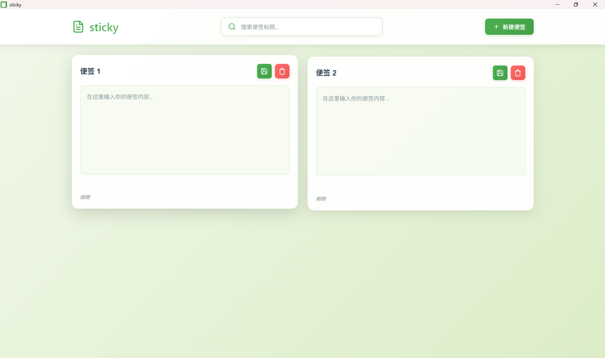

# Sticky Notes - 简约便签应用

<div align="center">
  
  
  <p>一个简洁、高效的桌面便签应用，基于 Electron 构建</p>
  
  [](https://opensource.org/licenses/MIT)
  [](https://electronjs.org/)
  [](https://github.com/electron/electron)
</div>

## ✨ 功能特点

- 📝 **便签管理** - 创建、编辑、删除便签
- 🔍 **实时搜索** - 快速查找便签内容
- 🎨 **现代UI** - 简洁美观的用户界面
- 🔒 **安全可靠** - 本地数据存储，隐私有保障

## 📸 预览



## 🚀 快速开始

### 环境要求

- [Node.js](https://nodejs.org/) (推荐 v16 或更高版本)
- npm 或 yarn

### 安装步骤

1. **克隆仓库**
   ```bash
   git clone https://github.com/your-username/sticky.git
   cd sticky
   ```

2. **安装依赖**
   ```bash
   npm install
   ```

3. **启动应用**
   ```bash
   npm start
   ```

### 构建应用

```bash
# 构建应用
npm run build

# 构建 Windows 版本
npm run build:win

# 生成分发包
npm run dist
```

## 📁 项目结构

```
sticky/
├── main.js          # Electron 主进程
├── renderer.js      # 渲染进程逻辑
├── preload.js       # 预加载脚本
├── index.html       # 主界面
├── styles.css       # 样式文件
├── server.js        # 开发服务器
├── icon-512.png     # 应用图标
├── favicon.ico      # 网站图标
├── package.json     # 项目配置
├── progress.md      # 开发进度
└── README.md        # 项目说明
```

## 🛠️ 技术栈

- **框架**: [Electron](https://electronjs.org/) - 跨平台桌面应用开发
- **前端**: HTML5 + CSS3 + JavaScript (ES6+)
- **构建工具**: [electron-builder](https://www.electron.build/) - 应用打包
- **存储**: LocalStorage + 文件系统双重备份

## 📋 使用说明

1. **创建便签**: 点击"新建便签"按钮
2. **编辑便签**: 直接点击便签内容进行编辑
3. **搜索便签**: 在搜索框中输入关键词快速查找
4. **删除便签**: 点击便签右上角的删除按钮
5. **自动保存**: 编辑内容会自动保存，无需手动操作


## 🐛 问题反馈

如果你发现了 bug 或有功能建议，请：

1. 查看 [Issues](https://github.com/your-username/sticky/issues) 确认问题未被报告
2. 创建新的 Issue，详细描述问题或建议
3. 如果可能，请提供复现步骤

## 📄 许可证

本项目基于 [MIT License](LICENSE) 开源协议。